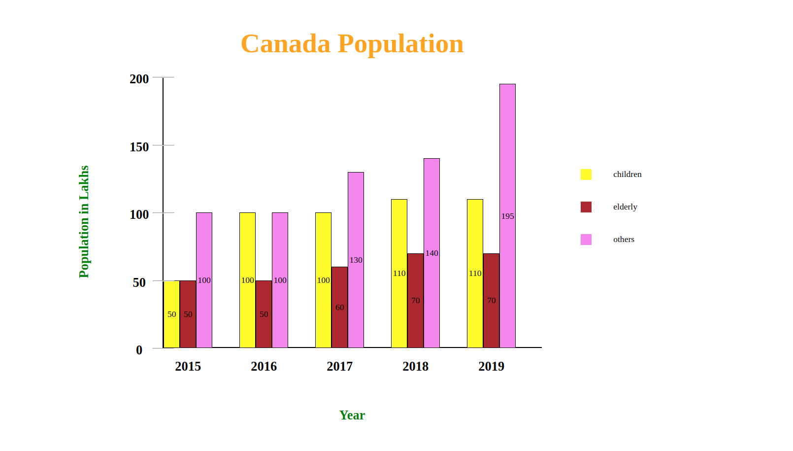
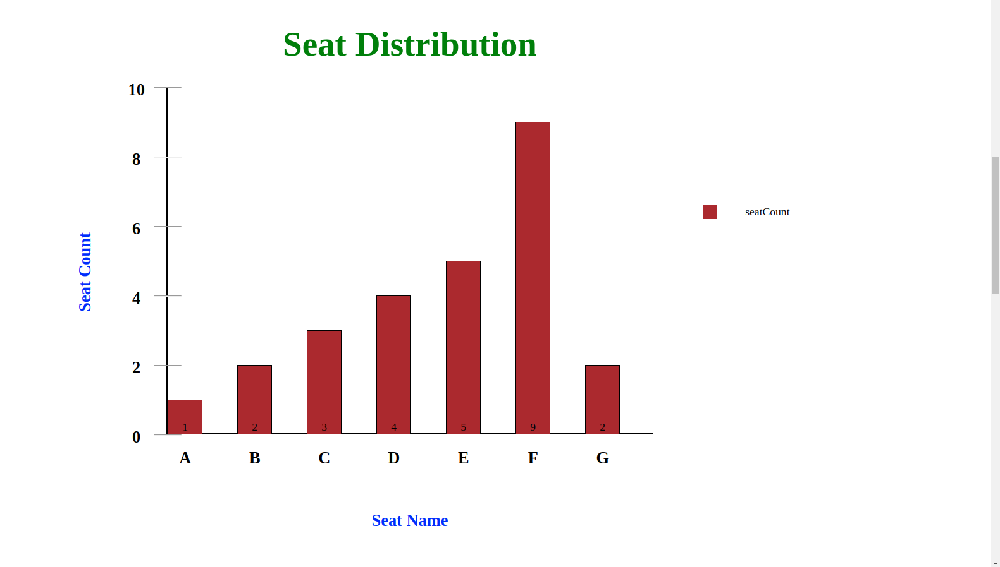

# bar-chart.js

A bar chart library to draw single valued and multi valued bar chart

## Prerequisites

1. jQuery library is required

## Function parameters for Bar Chart

1. data - An array of objects

   a. label(x axis) and value(y axis) are the object attributes
   b. label should be a string and value should be an array of numerical values

      eg.
            data = [{
                label: "2015",
                value: [50, 50, 100]
            }, {
                label: "2016",
                value: [100, 50, 100]
            }, {
                label: "2017",
                value: [100, 60, 130]
            }, {
                label: "2018",
                value: [110, 70, 140]
            }, {
                label: "2019",
                value: [110, 70, 195]
            }];

2. options

   a. width should be provided in pixel ( width of the bar chart container). It should be numeric.  
   b. height should be provided in pixel ( height of the bar chart container). It should be numeric.  
   c. valuePosition - position of the value inside bar. It should be string ( can be "top", "bottom" or "center")  
   d. barColor - colors of individual bars. It should be an array of strings  
   e. labelColor - color of  label(x and y). It should be string.  
   f. barSpacing - space between the bars in px. Should be numeric.  
   g. tickValues - values that should show tick. Should be an array of numbers.  
   f. titleFontSize - font size of title.  
   g. barTitle, xAxis, yAxis - title of bar diagaram, x axis and y axis respectively. All these should be string.  
   h. titleFontSize - font size of the title in px. Should be numeric.  
   i. titleColor - color of the bar title. It should be string.  
   h. barLabels- Names of individual bars. It should be an array of string  

      eg. options = {  
        width: 700,  
        height: 500,  
        valuePosition: "top",  
        barColor: ["yellow","brown","violet"],  
        labelColor: "green",  
        barSpacing: 50,  
        tickValues: [0,50,100,150,200],  
        barTitle: "Canada Population",  
        titleFontSize: 50,  
        titleColor: "red",  
        xAxis: "Year",  
        yAxis: "Population in Lakhs",  
        barLabels: ["children","elderly","others"]  
      };  

3. element

   Bar chart will be added inside the element at the end

4. All the arguments are mandatory.
5. Count of values for individual bar and the count of barcolor and barLabels should be same

     eg.
        value: [110, 70, 195]  
        barColor: ["yellow", "brown", "violet"]  
        barLabels:["children", "elderly", "others"]  

## Example Bar Charts

  
  

## GitHub page

   <https://neethu-ms.github.io/bar-chart/>  
